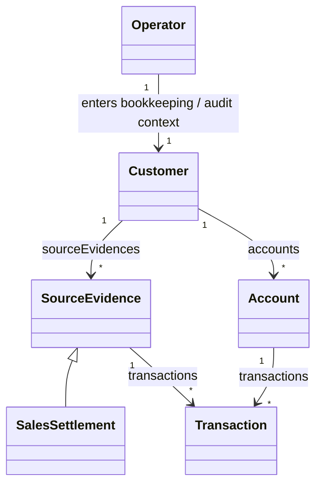
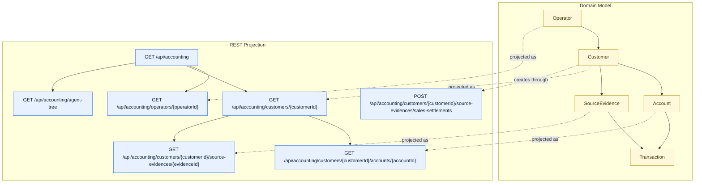

# Smart Domain

Smart Domain is a publishable Java product line for domain models built around association
objects, context-specific roles, progressive-loading persistence, and HATEOAS-first API exposure.

It takes the ideas demonstrated in the public accounting example from
[`Re-engineering-Domain-Driven-Design/Accounting`](https://github.com/Re-engineering-Domain-Driven-Design/Accounting)
and turns them into reusable modules that can be published, imported, and composed in real
projects.

## Why Smart Domain Exists

Typical CRUD-style domain models break down in the same places:

- one-to-many relationships collapse into raw `List` fields
- permission and context logic leaks into application services
- persistence concerns force eager loading into entity code
- API layers become a second model instead of a projection of the domain

Smart Domain keeps those concerns separate without flattening the model:

- model one-to-many relationships as association objects instead of raw `List`
- model context-specific behavior as role objects instead of service-layer permission checks
- keep entity behavior in domain types
- let persistence adapters load data lazily and in batches
- project the same domain model as a HATEOAS-first API instead of rebuilding it as DTO graphs

## Who Should Use Smart Domain

Smart Domain fits projects that already have, or intentionally want, a real domain model:

- business entities have behavior, not only getters and setters
- one-to-many relationships carry domain semantics and should not be hidden as raw collections
- the same entity behaves differently in different contexts or roles
- persistence strategy varies by association and should not leak into core model code
- REST APIs should stay close to domain navigation instead of being rebuilt as separate resource trees

It is especially useful when a team wants domain language to survive across model, persistence, and
API layers.

## Who Should Not Use Smart Domain

Smart Domain is probably the wrong default when:

- the application is mostly CRUD forms over flat tables
- entities are simple records with little or no behavior
- the team does not want explicit association objects or role types
- persistence convenience matters more than domain correspondence
- the API is intentionally optimized as a separate contract unrelated to domain navigation

In those cases, a simpler record-oriented stack will usually be easier to learn and cheaper to
maintain.

## A Concrete Example

The canonical case in this repository is the `accounting` demo. It starts from a simple business
story:

- a `Customer` owns `sourceEvidences`
- a `Customer` owns `accounts`
- an `Account` owns `transactions`
- a `SourceEvidence` also owns `transactions`

One concrete flow is recording a sales settlement:

1. create a source evidence such as `SalesSettlement`
2. let that evidence materialize transaction descriptions
3. write those transactions into account associations
4. update account balances in the same domain flow

That flow stays inside domain objects instead of being split across controllers, services, and
query utilities.

## The Core Pattern

The central modeling rule is simple:

1. the entity owns an association field
2. the entity exposes a narrow read API
3. the entity defines a wider interface as the persistence extension point
4. an adapter implements that interface
5. API resources project the same model outward

In practice it looks like this:

```java
public class Account extends Entity<String> {

  private Transactions transactions;

  public HasMany<String, Transaction> transactions() {
    return transactions;
  }

  public interface Transactions extends HasMany<String, Transaction> {
    void add(Transaction transaction);
  }
}
```

Then the persistence side implements the wide interface with a matching adapter, such as
`AccountTransactions`, and the API side exposes the same relationship as a navigable resource.

## Ownership And Context

The accounting demo is not only about associations. It also shows how behavior changes by context.



What matters here is ownership and role boundary, not only cardinality:

- `BookkeepingContext` switches `Operator -> Customer -> Bookkeeper`
- `AuditContext` switches `Operator -> Customer -> Auditor`
- `AccountContext` switches `Operator -> Account -> Accountant`
- `EvidenceReviewContext` switches `Operator -> SourceEvidence -> EvidenceReviewer`

This avoids scattering permission checks and mode flags across service classes. Behavior lives in
role objects near the domain it belongs to.

### Combined View

The same demo can also be read as one end-to-end map from business root to role switch to
association lifecycle:

```mermaid
flowchart TB
  subgraph Context["Context Switching"]
    Operator[Operator]
    BookkeepingContext[BookkeepingContext]
    AuditContext[AuditContext]
    AccountContext[AccountContext]
    EvidenceReviewContext[EvidenceReviewContext]
    Bookkeeper[Bookkeeper role]
    Auditor[Auditor role]
    Accountant[Accountant role]
    EvidenceReviewer[EvidenceReviewer role]

    Operator --> BookkeepingContext --> Bookkeeper
    Operator --> AuditContext --> Auditor
    Operator --> AccountContext --> Accountant
    Operator --> EvidenceReviewContext --> EvidenceReviewer
  end

  subgraph Domain["Domain Ownership"]
    Customer[Customer]
    Account[Account]
    SourceEvidence[SourceEvidence]
    SalesSettlement[SalesSettlement]
    Transaction[Transaction]
    CustomerAccounts[[Customer.accounts()]]
    CustomerSourceEvidences[[Customer.sourceEvidences()]]
    AccountTransactions[[Account.transactions()]]
    EvidenceTransactions[[SourceEvidence.transactions()]]

    Customer -->|owns| CustomerAccounts --> Account
    Customer -->|owns| CustomerSourceEvidences --> SourceEvidence
    SourceEvidence -->|subtype| SalesSettlement
    Account -->|owns| AccountTransactions --> Transaction
    SourceEvidence -->|owns| EvidenceTransactions --> Transaction
  end

  subgraph Lifecycle["Association Lifecycle"]
    Aggregated[aggregated lifecycle]
    Reference[reference lifecycle]
  end

  Bookkeeper --> Customer
  Auditor --> Customer
  Accountant --> Account
  EvidenceReviewer --> SourceEvidence

  EvidenceTransactions --> Aggregated
  AccountTransactions --> Reference

  classDef context fill:#E8F1FF,stroke:#2F6FEB,color:#0B1F33,stroke-width:1px;
  classDef role fill:#EAFBF3,stroke:#1A7F37,color:#0F2E1B,stroke-width:1px;
  classDef entity fill:#FFF8DB,stroke:#B08800,color:#3D2F00,stroke-width:1px;
  classDef assoc fill:#FFF1E8,stroke:#BC4C00,color:#4A1F00,stroke-width:1px;
  classDef lifecycle fill:#F4ECFF,stroke:#8250DF,color:#2E1065,stroke-width:1px;

  class BookkeepingContext,AuditContext,AccountContext,EvidenceReviewContext context;
  class Bookkeeper,Auditor,Accountant,EvidenceReviewer role;
  class Customer,Account,SourceEvidence,SalesSettlement,Transaction entity;
  class CustomerAccounts,CustomerSourceEvidences,AccountTransactions,EvidenceTransactions assoc;
  class Aggregated,Reference lifecycle;
```

## Lifecycle Styles

Smart Domain supports more than one persistence style inside the same business model.

The accounting demo intentionally mixes two lifecycles:

- aggregated lifecycle: `SourceEvidence.transactions()` stays in-memory and moves with the owning
  aggregate
- reference lifecycle: `Account.transactions()` is loaded through a lazy MyBatis-backed adapter

This is one of the main points of the pattern: business ownership does not force one persistence
strategy everywhere.

## From Domain Model To API

Smart Domain also treats the REST API as a projection of the model, not as a disconnected DTO
layer.

The accounting demo exposes:

- `GET /api/accounting`
- `GET /api/accounting/operators/{operatorId}`
- `GET /api/accounting/customers/{customerId}`
- `POST /api/accounting/customers/{customerId}/source-evidences/sales-settlements`
- `GET /api/accounting/customers/{customerId}/accounts/{accountId}`
- `GET /api/accounting/customers/{customerId}/source-evidences/{evidenceId}`
- `GET /api/accounting/agent-tree`

That projection can be read as a direct mapping from domain root to resource graph:



## How To Read The Diagrams

Use the diagrams in this order:

1. start with the class diagram to understand business ownership and inheritance
2. read the combined view to see how context switching, associations, and lifecycles fit together
3. read the API projection diagram to see how the same model becomes navigable resources

When reading them, keep these rules in mind:

- yellow nodes are business entities
- blue nodes are context or API boundary objects
- green nodes are role objects produced by context switching
- orange nodes are association objects owned by entities
- purple nodes mark lifecycle style, especially the difference between aggregated and reference associations

The same repository also includes an AI-facing example that reads the JSON link tree and follows
HAL-FORMS templates instead of hardcoding URLs:

```bash
./gradlew :demo:bootRun
node demo/examples/accounting-agent-mvp.js
```

## Product Layout

```text
smart-domain/
├── bom/
├── core/
├── api-hateoas/
├── api-jersey/
├── api-spring-boot-starter/
├── persistence/
├── mybatis/
├── mybatis-spring-boot-starter/
├── demo/
├── samples/consumer/
└── samples/api-consumer/
```

The product builds from `smart-domain/` directly and can be split into its own repository without
changing artifact coordinates.

## Public Entry Points

Most users should start with only these artifacts:

1. `smart-domain-bom`
2. `smart-domain-core`
3. `smart-domain-api-spring-boot-starter` when exposing Smart Domain resources over REST
4. `smart-domain-mybatis-spring-boot-starter` when integrating Smart Domain with MyBatis

These are the primary modules intended for external adoption.

## Modules

| Artifact | Purpose |
| --- | --- |
| `smart-domain-bom` | Version-alignment entrypoint |
| `smart-domain-core` | Core entity, association, and context-role abstractions |
| `smart-domain-api-spring-boot-starter` | Spring Boot entrypoint for API exposure |
| `smart-domain-api-model-tree-tool` | Utility for building recursive JSON link trees from API model source files |
| `smart-domain-mybatis-spring-boot-starter` | Spring Boot entrypoint for persistence integration |
| `smart-domain-api-hateoas` | Low-level HATEOAS and HAL-FORMS support |
| `smart-domain-api-jersey` | Low-level Jersey integration |
| `smart-domain-persistence` | Low-level hydration SPI |
| `smart-domain-mybatis` | Low-level MyBatis integration |

## Quick Start

### Gradle

```gradle
dependencies {
    implementation platform("io.github.jayclock:smart-domain-bom:${smartDomainVersion}")
    implementation "io.github.jayclock:smart-domain-core"
    implementation "io.github.jayclock:smart-domain-mybatis-spring-boot-starter"
    implementation "io.github.jayclock:smart-domain-api-spring-boot-starter"
}
```

### Maven

```xml
<dependencyManagement>
  <dependencies>
    <dependency>
      <groupId>io.github.jayclock</groupId>
      <artifactId>smart-domain-bom</artifactId>
      <version>${smartDomainVersion}</version>
      <type>pom</type>
      <scope>import</scope>
    </dependency>
  </dependencies>
</dependencyManagement>

<dependencies>
  <dependency>
    <groupId>io.github.jayclock</groupId>
    <artifactId>smart-domain-core</artifactId>
  </dependency>
  <dependency>
    <groupId>io.github.jayclock</groupId>
    <artifactId>smart-domain-mybatis-spring-boot-starter</artifactId>
  </dependency>
  <dependency>
    <groupId>io.github.jayclock</groupId>
    <artifactId>smart-domain-api-spring-boot-starter</artifactId>
  </dependency>
</dependencies>
```

### Build From Product Root

```bash
./gradlew build
./gradlew publishToMavenLocal
./gradlew -p samples/consumer test
./gradlew -p samples/api-consumer test
```

Coordinates:

- Group: `io.github.jayclock`
- Version: managed by the current repository release

## Learning Path

If you are new to Smart Domain, do not start from the low-level module list.

Start here instead:

1. [Getting Started](./getting-started.md)
2. [Accounting Demo](./demo/README.md)
3. [MyBatis Starter README](./mybatis-spring-boot-starter/README.md)
4. [API Quick Start](./api-quick-start.md)
5. [API Consumer Sample](./samples/api-consumer/README.md)

Recommended mental order:

1. understand the accounting case
2. draw ownership and context boundaries
3. model associations and role objects
4. implement persistence adapters
5. expose the same model as a RESTful API

## Stable Vs Internal API

Stable API:

- `io.github.jayclock.smartdomain.core.*`
- `io.github.jayclock.smartdomain.core.context.*`
- `io.github.jayclock.smartdomain.api.jersey.VendorMediaTypeInterceptor`
- `io.github.jayclock.smartdomain.boot.SmartDomainApiAutoConfiguration`
- `io.github.jayclock.smartdomain.boot.SmartDomainApiJerseyAutoConfiguration`
- `io.github.jayclock.smartdomain.boot.SmartDomainApiProperties`
- `io.github.jayclock.smartdomain.boot.EnableSmartDomainMybatis`

Internal API:

- types annotated with `io.github.jayclock.smartdomain.core.InternalApi`
- bootstrapping helpers and cache serialization types

Advanced module API:

- `io.github.jayclock.smartdomain.api.hateoas.*`
- `io.github.jayclock.smartdomain.persistence.EntityHydrator`
- `io.github.jayclock.smartdomain.persistence.AbstractReflectiveEntityHydrator`
- `io.github.jayclock.smartdomain.persistence.HydratingCacheManager`
- `io.github.jayclock.smartdomain.mybatis.AssociationMapping`
- `io.github.jayclock.smartdomain.mybatis.GenericEntityHydrator`
- `io.github.jayclock.smartdomain.mybatis.database.EntityList`

## When To Use Low-Level Modules

The advanced modules are published, but they are composition modules rather than the primary
product entrypoints:

- `smart-domain-api-hateoas`
- `smart-domain-api-jersey`
- `smart-domain-persistence`
- `smart-domain-mybatis`

Use them only when you intentionally need lower-level control, such as:

- building without Spring Boot
- integrating only the HATEOAS layer
- integrating only the MyBatis layer
- extending Smart Domain internals in framework-specific ways

## Docs

- [Getting Started](./getting-started.md)
- [Accounting Demo](./demo/README.md)
- [API Quick Start](./api-quick-start.md)
- [Release Readiness](./docs/release-readiness.md)
- [Releasing](./RELEASING.md)
- [Repository Split Readiness](./docs/repository-split-readiness.md)
- [Migration Guide](./docs/migration-from-team-ai.md)
- [Naming Conventions](./docs/naming-conventions.md)
- [Context Roles](./docs/context-roles.md)
- [Starter README](./mybatis-spring-boot-starter/README.md)
- [API Jersey README](./api-jersey/README.md)
- [API Starter README](./api-spring-boot-starter/README.md)
- [API Consumer Sample](./samples/api-consumer/README.md)
- [BOM README](./bom/README.md)
