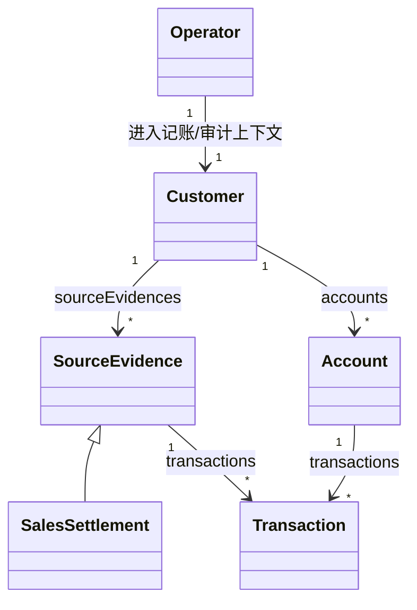
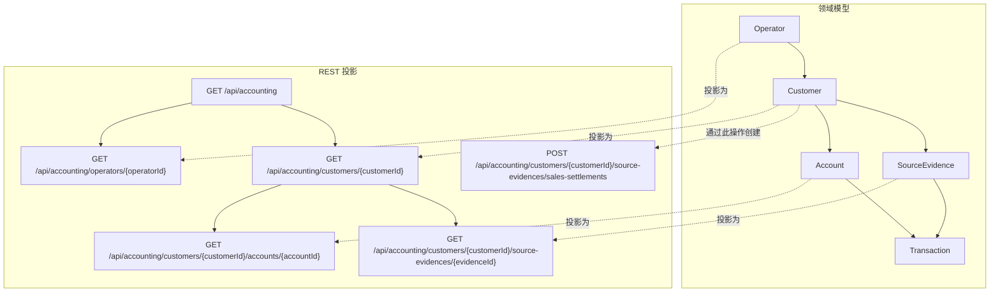

# Smart Domain

[English](./README.md) | 简体中文

Smart Domain 是一组可发布的 Java 17 组件，用于构建以关联对象、上下文角色、渐进加载持久化和 HATEOAS API 为核心的领域模型。

项目把公开会计示例 [`Re-engineering-Domain-Driven-Design/Accounting`](https://github.com/Re-engineering-Domain-Driven-Design/Accounting) 中的思想整理成可发布、可导入、可组合的模块。

## 为什么需要 Smart Domain

典型 CRUD 领域模型经常出现以下问题：

- 一对多关系退化为原始 `List` 字段；
- 权限和上下文逻辑泄漏到应用 Service；
- 持久化方式迫使实体代码采用立即加载；
- API 层重新建立一套与领域分离的 DTO 模型。

Smart Domain 通过以下方式分离关注点，同时保留领域模型：

- 用关联对象而不是原始 `List` 表达一对多关系；
- 用上下文角色而不是 Service 权限判断表达上下文行为；
- 让实体行为保留在领域类型中；
- 让持久化适配器延迟、渐进或批量加载数据；
- 将同一个领域模型投影为 HATEOAS API，而不是重新构造 DTO 对象图。

## 适用场景

Smart Domain 适合已经拥有或明确希望建立富领域模型的项目：

- 业务实体包含行为，而不只是 getter/setter；
- 一对多关系具有领域语义，不能简单隐藏成集合；
- 同一个实体在不同上下文或角色中具有不同能力；
- 不同关联需要不同持久化策略，且策略不能侵入核心模型；
- REST API 应贴近领域导航，而不是独立建立资源树。

它尤其适合希望领域语言贯穿模型、持久化和 API 各层的团队。

## 不适用场景

以下项目通常更适合简单的记录式技术栈：

- 应用主要是平面数据表上的 CRUD 表单；
- 实体是几乎没有行为的简单记录；
- 团队不希望显式使用关联对象或角色类型；
- 持久化便利性比领域对应关系更重要；
- API 被明确设计为与领域导航无关的独立协议。

## 会计业务示例

仓库的标准案例位于 `demo/`，包含以下关系：

- `Customer` 拥有 `sourceEvidences`；
- `Customer` 拥有 `accounts`；
- `Account` 拥有 `transactions`；
- `SourceEvidence` 也拥有 `transactions`。

记录销售结算的流程是：

1. 创建 `SalesSettlement` 等原始凭证；
2. 由凭证生成交易描述；
3. 把交易写入对应账户关联；
4. 在同一个领域流程中更新账户余额。

该流程保留在领域对象中，不会拆散到 Controller、Service 和查询工具中。

## 无服务架构契约

Smart Domain 有意采用 **No-Service** 领域架构。业务行为从根关联、实体或上下文角色开始，并通过实体拥有的关联对象继续执行：

```text
HTTP 资源 -> 根关联 -> 实体/上下文角色 -> 关联 -> 适配器
```

组合根可以装配对象，HTTP 资源可以处理协议，基础设施可以提供事务边界；但它们都不能拥有领域决策，也不能通过仓储编排贫血实体。

规范详见：

- [模式契约](./docs/pattern-contract.zh-CN.md)
- [关联模式示例](./docs/association-recipes.zh-CN.md)
- [反模式](./docs/anti-patterns.zh-CN.md)

## 核心模式

中心规则如下：

1. 实体拥有一个关联字段；
2. 实体对外暴露窄读取接口；
3. 实体定义更宽的内部接口作为持久化扩展点；
4. 适配器实现该宽接口；
5. API 资源向外投影同一个模型。

```java
public class Account implements Entity<String, AccountDescription> {

  private Transactions transactions;

  public HasMany<String, Transaction> transactions() {
    return transactions;
  }

  public interface Transactions extends HasMany<String, Transaction> {
    void add(Transaction transaction);
  }
}
```

持久化侧以 `AccountTransactions` 等对应名称实现宽接口，API 侧把同一关系暴露为可导航资源。

## 所有权和上下文

会计 Demo 同时展示上下文中的行为差异：



关键是所有权和角色边界，而不仅是基数：

- `BookkeepingContext`：`Operator -> Customer -> Bookkeeper`
- `AuditContext`：`Operator -> Customer -> Auditor`
- `AccountContext`：`Operator -> Account -> Accountant`
- `EvidenceReviewContext`：`Operator -> SourceEvidence -> EvidenceReviewer`

这样无需把权限判断和模式标志散落在 Service 中，行为保留在靠近领域的角色对象上。

## 关联生命周期

同一个业务模型可以混合不同持久化方式：

- 聚合生命周期：`SourceEvidence.transactions()` 保存在内存中并随拥有者移动；
- 引用生命周期：`Account.transactions()` 通过 MyBatis 适配器延迟加载；
- 根生命周期：`Customers`、`Operators` 等入口负责定位根实体。

业务所有权不会强制所有关联采用同一种持久化策略。

## 从领域模型到 API

Smart Domain 把 REST API 视为模型投影，而不是断开的 DTO 层。会计 Demo 暴露：

- `GET /api/accounting`
- `GET /api/accounting/operators/{operatorId}`
- `GET /api/accounting/customers/{customerId}`
- `POST /api/accounting/customers/{customerId}/source-evidences/sales-settlements`
- `GET /api/accounting/customers/{customerId}/accounts/{accountId}`
- `GET /api/accounting/customers/{customerId}/source-evidences/{evidenceId}`



## 产品目录

```text
smart-domain/
├── bom/
├── core/
├── api-hateoas/
├── api-jersey/
├── api-spring-boot-starter/
├── persistence/
├── mybatis/
├── mybatis-spring-boot-starter/
├── demo/
├── samples/consumer/
└── samples/api-consumer/
```

## 公共入口

大多数用户从以下组件开始：

1. `smart-domain-bom`
2. `smart-domain-core`
3. 暴露 REST API 时使用 `smart-domain-api-spring-boot-starter`
4. 集成 MyBatis 时使用 `smart-domain-mybatis-spring-boot-starter`

| 组件 | 用途 |
| --- | --- |
| `smart-domain-bom` | 统一组件版本 |
| `smart-domain-core` | 实体、关联和上下文角色核心抽象 |
| `smart-domain-api-spring-boot-starter` | API 暴露的 Spring Boot 入口 |
| `smart-domain-mybatis-spring-boot-starter` | MyBatis 持久化的 Spring Boot 入口 |
| `smart-domain-api-hateoas` | 底层 HATEOAS 和 HAL-FORMS 支持 |
| `smart-domain-api-jersey` | 底层 Jersey 集成 |
| `smart-domain-persistence` | 底层 Hydration SPI |
| `smart-domain-mybatis` | 底层 MyBatis 集成 |

## 快速开始

### Gradle

```gradle
dependencies {
    implementation platform("io.github.jayclock:smart-domain-bom:${smartDomainVersion}")
    implementation "io.github.jayclock:smart-domain-core"
    implementation "io.github.jayclock:smart-domain-mybatis-spring-boot-starter"
    implementation "io.github.jayclock:smart-domain-api-spring-boot-starter"
}
```

### Maven

```xml
<dependencyManagement>
  <dependencies>
    <dependency>
      <groupId>io.github.jayclock</groupId>
      <artifactId>smart-domain-bom</artifactId>
      <version>${smartDomainVersion}</version>
      <type>pom</type>
      <scope>import</scope>
    </dependency>
  </dependencies>
</dependencyManagement>

<dependencies>
  <dependency>
    <groupId>io.github.jayclock</groupId>
    <artifactId>smart-domain-core</artifactId>
  </dependency>
</dependencies>
```

组件坐标：

- Group：`io.github.jayclock`
- Version：由当前仓库发布版本管理

## 从源码构建

```bash
./gradlew build
./gradlew publishToMavenLocal
./gradlew -p samples/consumer test
./gradlew -p samples/api-consumer test
```

## 推荐学习顺序

1. [模式契约](./docs/pattern-contract.zh-CN.md)
2. [入门指南](./getting-started.zh-CN.md)
3. [会计 Demo](./demo/README.zh-CN.md)
4. [关联模式示例](./docs/association-recipes.zh-CN.md)
5. [MyBatis Starter](./mybatis-spring-boot-starter/README.zh-CN.md)
6. [API 快速开始](./api-quick-start.zh-CN.md)
7. [API 使用示例](./samples/api-consumer/README.zh-CN.md)

推荐的理解顺序是：

```text
无服务契约
→ 根关联、所有权和上下文边界
→ 窄/宽关联与角色对象
→ 持久化适配器
→ REST/HATEOAS 投影
```

## API 稳定性

稳定 API 主要包括：

- `io.github.jayclock.smartdomain.core.*`
- `io.github.jayclock.smartdomain.core.context.*`
- `io.github.jayclock.smartdomain.api.jersey.VendorMediaTypeInterceptor`
- `io.github.jayclock.smartdomain.boot.SmartDomainApiAutoConfiguration`
- `io.github.jayclock.smartdomain.boot.SmartDomainApiJerseyAutoConfiguration`
- `io.github.jayclock.smartdomain.boot.SmartDomainApiProperties`
- `io.github.jayclock.smartdomain.boot.EnableSmartDomainMybatis`

使用 `io.github.jayclock.smartdomain.core.InternalApi` 标记的类型属于内部 API。`api-hateoas`、`persistence` 和 `mybatis` 中的一些类型属于高级组合 API，适用于不使用 Spring Boot 或需要扩展底层集成的场景。

## 文档

- [模式契约](./docs/pattern-contract.zh-CN.md)
- [关联模式示例](./docs/association-recipes.zh-CN.md)
- [反模式](./docs/anti-patterns.zh-CN.md)
- [入门指南](./getting-started.zh-CN.md)
- [会计 Demo](./demo/README.zh-CN.md)
- [API 快速开始](./api-quick-start.zh-CN.md)
- [发布就绪状态](./docs/release-readiness.zh-CN.md)
- [发布指南](./RELEASING.md)
- [仓库独立检查](./docs/repository-split-readiness.zh-CN.md)
- [命名约定](./docs/naming-conventions.zh-CN.md)
- [上下文角色](./docs/context-roles.zh-CN.md)
- [MyBatis Starter](./mybatis-spring-boot-starter/README.zh-CN.md)
- [API Jersey](./api-jersey/README.zh-CN.md)
- [API Starter](./api-spring-boot-starter/README.zh-CN.md)
- [API 使用示例](./samples/api-consumer/README.zh-CN.md)
- [BOM](./bom/README.zh-CN.md)
