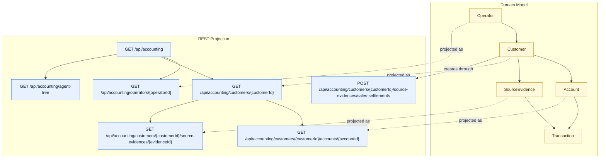

# Smart Domain Accounting Demo

This module is the main runnable example of the Smart Domain pattern.

It uses the accounting case from the public `Accounting` reference and extends it with Smart
Domain context switching.

## Domain Overview

The demo has one business root and four context roles:

| Area | Role | Domain Entry | Adapter | Lifecycle |
| --- | --- | --- | --- | --- |
| Bookkeeping | `Bookkeeper` | `Customer.sourceEvidences` | `memory.InMemoryCustomers#CustomerSourceEvidences` | aggregated |
| Audit | `Auditor` | `Customer.accounts` | `memory.InMemoryCustomers#CustomerAccounts` | root association |
| Account analysis | `Accountant` | `Account.transactions` | `mybatis.AccountTransactions` | reference |
| Evidence review | `EvidenceReviewer` | `SourceEvidence.transactions` | `memory.SourceEvidenceTransactions` | aggregated |

This keeps one coherent business story while still showing mixed persistence styles.

### Domain Map

The following diagram uses the same visual language as the root README so the demo can be read as
one connected architecture:

```mermaid
flowchart TB
  subgraph Context["Context Switching"]
    Operator[Operator]
    BookkeepingContext[BookkeepingContext]
    AuditContext[AuditContext]
    AccountContext[AccountContext]
    EvidenceReviewContext[EvidenceReviewContext]
    Bookkeeper[Bookkeeper role]
    Auditor[Auditor role]
    Accountant[Accountant role]
    EvidenceReviewer[EvidenceReviewer role]

    Operator --> BookkeepingContext --> Bookkeeper
    Operator --> AuditContext --> Auditor
    Operator --> AccountContext --> Accountant
    Operator --> EvidenceReviewContext --> EvidenceReviewer
  end

  subgraph Domain["Domain Ownership"]
    Customer[Customer]
    Account[Account]
    SourceEvidence[SourceEvidence]
    SalesSettlement[SalesSettlement]
    Transaction[Transaction]
    CustomerAccounts[[Customer.accounts()]]
    CustomerSourceEvidences[[Customer.sourceEvidences()]]
    AccountTransactions[[Account.transactions()]]
    EvidenceTransactions[[SourceEvidence.transactions()]]

    Customer -->|owns| CustomerAccounts --> Account
    Customer -->|owns| CustomerSourceEvidences --> SourceEvidence
    SourceEvidence -->|subtype| SalesSettlement
    Account -->|owns| AccountTransactions --> Transaction
    SourceEvidence -->|owns| EvidenceTransactions --> Transaction
  end

  subgraph Lifecycle["Association Lifecycle"]
    Aggregated[aggregated lifecycle]
    RootAssociation[root association]
    Reference[reference lifecycle]
  end

  Bookkeeper --> CustomerSourceEvidences
  Auditor --> CustomerAccounts
  Accountant --> AccountTransactions
  EvidenceReviewer --> EvidenceTransactions

  CustomerSourceEvidences --> Aggregated
  CustomerAccounts --> RootAssociation
  EvidenceTransactions --> Aggregated
  AccountTransactions --> Reference

  classDef context fill:#E8F1FF,stroke:#2F6FEB,color:#0B1F33,stroke-width:1px;
  classDef role fill:#EAFBF3,stroke:#1A7F37,color:#0F2E1B,stroke-width:1px;
  classDef entity fill:#FFF8DB,stroke:#B08800,color:#3D2F00,stroke-width:1px;
  classDef assoc fill:#FFF1E8,stroke:#BC4C00,color:#4A1F00,stroke-width:1px;
  classDef lifecycle fill:#F4ECFF,stroke:#8250DF,color:#2E1065,stroke-width:1px;

  class BookkeepingContext,AuditContext,AccountContext,EvidenceReviewContext context;
  class Bookkeeper,Auditor,Accountant,EvidenceReviewer role;
  class Customer,Account,SourceEvidence,SalesSettlement,Transaction entity;
  class CustomerAccounts,CustomerSourceEvidences,AccountTransactions,EvidenceTransactions assoc;
  class Aggregated,RootAssociation,Reference lifecycle;
```

## Why This Demo Exists

- Keep the example independent from Team AI business concepts
- Show how `HasMany` becomes a first-class domain object
- Show how `ContextSwitcher` produces role objects
- Show how one accounting model can mix aggregated and reference lifecycle associations
- Provide one copyable accounting template for future projects

## Structure

```text
demo/
└── accounting/
    ├── description/
    │   ├── CustomerDescription
    │   ├── AccountDescription
    │   ├── SalesSettlementDescription
    │   ├── TransactionDescription
    │   └── OperatorDescription
    ├── model/
    │   ├── Customer
    │   ├── Account
    │   ├── SourceEvidence
    │   ├── SalesSettlement
    │   ├── Transaction
    │   ├── Operator
    │   ├── Bookkeeper
    │   ├── Auditor
    │   ├── BookkeepingContext
    │   └── AuditContext
    ├── memory/
    │   ├── InMemoryCustomers
    │   ├── InMemoryOperators
    │   ├── CustomerAssignments
    │   ├── SourceEvidenceTransactions
    │   ├── DefaultBookkeepingContext
    │   └── DefaultAuditContext
    ├── mybatis/
    │   ├── AccountingLedgerMapper
    │   ├── AccountTransactions
    │   └── config/AccountingDemoSmartDomainMybatisConfiguration
    └── api/
        ├── AccountingApi
        ├── AccountingRootModel
        ├── CustomerModel
        ├── AccountModel
        ├── SourceEvidenceModel
        ├── TransactionModel
        ├── AccountingMediaTypes
        └── AccountingDemoApplication
```

## The Correspondence Rule

The pattern used in this demo is:

1. the entity owns a field like `private Transactions transactions;`
2. the entity exposes a narrow interface like `HasMany<String, Transaction> transactions()`
3. the entity defines a wide interface like `interface Transactions extends HasMany<String, Transaction> { ... }`
4. the persistence adapter implements that wide interface with a matching class name like `AccountTransactions`
5. the starter config points to the adapter package and leaf entities with `@EnableSmartDomainMybatis`

That naming rule is what keeps the model layer and persistence layer aligned.

## Accounting Example

The accounting side uses the original association shape from the reference repository:

- `Customer.sourceEvidences`
- `Customer.accounts`
- `Account.transactions`
- `SourceEvidence.transactions`

The central behavior is `Customer.record(...)`, which:

1. creates a source evidence such as `SalesSettlement`
2. asks the evidence to materialize transaction descriptions
3. writes those transactions into the target account associations
4. updates account balance in the same domain flow

Relevant files:

- `src/main/java/reengineering/ddd/demo/accounting/model/Customer.java`
- `src/main/java/reengineering/ddd/demo/accounting/model/Account.java`
- `src/main/java/reengineering/ddd/demo/accounting/model/SalesSettlement.java`
- `src/main/java/reengineering/ddd/demo/accounting/model/Transaction.java`

## Context Switching Example

This demo adds context roles on top of the accounting model:

- `BookkeepingContext` switches `Operator -> Customer -> Bookkeeper`
- `AuditContext` switches `Operator -> Customer -> Auditor`
- `AccountContext` switches `Operator -> Account -> Accountant`
- `EvidenceReviewContext` switches `Operator -> SourceEvidence -> EvidenceReviewer`

The `Bookkeeper` role records source evidences. The `Auditor` role reads accounts. The
`Accountant` role works directly inside an `Account`, and `EvidenceReviewer` works directly inside
a `SourceEvidence`. This creates layered context switching instead of a single flat role lookup.

Relevant files:

- `src/main/java/reengineering/ddd/demo/accounting/model/Bookkeeper.java`
- `src/main/java/reengineering/ddd/demo/accounting/model/Auditor.java`
- `src/main/java/reengineering/ddd/demo/accounting/model/Accountant.java`
- `src/main/java/reengineering/ddd/demo/accounting/model/EvidenceReviewer.java`
- `src/main/java/reengineering/ddd/demo/accounting/memory/DefaultBookkeepingContext.java`
- `src/main/java/reengineering/ddd/demo/accounting/memory/DefaultAuditContext.java`
- `src/main/java/reengineering/ddd/demo/accounting/memory/DefaultAccountContext.java`
- `src/main/java/reengineering/ddd/demo/accounting/memory/DefaultEvidenceReviewContext.java`

## Runtime Correspondence Example

The starter layer adds runtime wiring without introducing Team AI business packages:

- Association scan root: `reengineering.ddd.demo.accounting.mybatis`
- Leaf entity registration: `Transaction.class`
- Starter descriptor: `AccountingDemoSmartDomainMybatisConfiguration`

## REST API Example

The accounting demo also exposes a HATEOAS-first API:

- `GET /api/accounting`
- `GET /api/accounting/operators/{operatorId}`
- `GET /api/accounting/customers/{customerId}`
- `POST /api/accounting/customers/{customerId}/source-evidences/sales-settlements`
- `GET /api/accounting/customers/{customerId}/accounts/{accountId}`
- `GET /api/accounting/customers/{customerId}/source-evidences/{evidenceId}`
- `GET /api/accounting/agent-tree`

The API layer lives under:

- `src/main/java/reengineering/ddd/demo/accounting/api`

### API Projection Map

The API can be read as a projection of the same domain graph rather than a separate resource model:



## How To Read The Demo Diagrams

Use the diagrams in this order:

1. start with the domain overview table to see each role, entry point, adapter, and lifecycle
2. read the domain map to understand how context switching and associations fit together
3. read the API projection map to see how the same model becomes navigable REST resources

When reading them, keep these rules in mind:

- yellow nodes are business entities
- blue nodes are context or API boundary objects
- green nodes are role objects produced by context switching
- orange nodes are association objects owned by entities
- purple nodes mark lifecycle style, including aggregated, root association, and reference handling

## Agent Tree Example

The accounting demo keeps a runnable agent example that:

1. reads `/api/accounting/agent-tree`
2. accepts AI-provided `agent-plan` step arrays
3. resolves rel-by-rel navigation from the JSON tree
4. follows `_links`
5. finds HAL-FORMS templates by rel or target
6. constructs request data from template properties
7. posts or reads resources without hardcoding endpoint paths
8. prints an execution trace and final resource summary for each plan

The current script includes multiple AI-provided plans:

- record a sales settlement from `customer -> source-evidences`
- inspect source evidence from `customer -> account -> transaction -> source-evidence`
- pivot back to account from `customer -> source-evidence -> transaction -> account`

Run it with:

```bash
cd smart-domain
./gradlew :demo:bootRun
node demo/examples/accounting-agent-mvp.js
```

## Run The Demo

```bash
cd smart-domain
./gradlew :demo:bootRun
./gradlew :demo:test --tests reengineering.ddd.demo.accounting.AccountingApiTest
```
