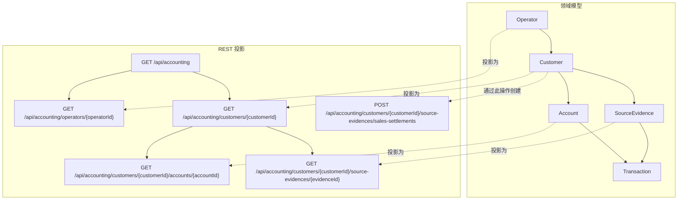

# Smart Domain 会计 Demo

[English](./README.md) | 简体中文

该模块是 Smart Domain 模式的主要可运行示例。它采用公开 Accounting 参考项目中的会计案例，并增加 Smart Domain 上下文切换。

## 领域概览

Demo 包含一个业务根和四种上下文角色：

| 领域 | 角色 | 领域入口 | 适配器 | 生命周期 |
| --- | --- | --- | --- | --- |
| 记账 | `Bookkeeper` | `Customer.sourceEvidences` | `memory.InMemoryCustomers#CustomerSourceEvidences` | 聚合 |
| 审计 | `Auditor` | `Customer.accounts` | `memory.InMemoryCustomers#CustomerAccounts` | 根关联 |
| 账户分析 | `Accountant` | `Account.transactions` | `mybatis.AccountTransactions` | 引用 |
| 凭证审查 | `EvidenceReviewer` | `SourceEvidence.transactions` | `memory.SourceEvidenceTransactions` | 聚合 |

一个连贯的业务故事中同时展示了多种持久化方式。

### 领域图

```mermaid
flowchart TB
  subgraph Context["上下文切换"]
    Operator[Operator]
    BookkeepingContext[BookkeepingContext]
    AuditContext[AuditContext]
    AccountContext[AccountContext]
    EvidenceReviewContext[EvidenceReviewContext]
    Bookkeeper[Bookkeeper 角色]
    Auditor[Auditor 角色]
    Accountant[Accountant 角色]
    EvidenceReviewer[EvidenceReviewer 角色]

    Operator --> BookkeepingContext --> Bookkeeper
    Operator --> AuditContext --> Auditor
    Operator --> AccountContext --> Accountant
    Operator --> EvidenceReviewContext --> EvidenceReviewer
  end

  subgraph Domain["领域所有权"]
    Customer[Customer]
    Account[Account]
    SourceEvidence[SourceEvidence]
    SalesSettlement[SalesSettlement]
    Transaction[Transaction]
    CustomerAccounts[[Customer.accounts()]]
    CustomerSourceEvidences[[Customer.sourceEvidences()]]
    AccountTransactions[[Account.transactions()]]
    EvidenceTransactions[[SourceEvidence.transactions()]]

    Customer -->|拥有| CustomerAccounts --> Account
    Customer -->|拥有| CustomerSourceEvidences --> SourceEvidence
    SourceEvidence -->|子类型| SalesSettlement
    Account -->|拥有| AccountTransactions --> Transaction
    SourceEvidence -->|拥有| EvidenceTransactions --> Transaction
  end

  subgraph Lifecycle["关联生命周期"]
    Aggregated[聚合生命周期]
    RootAssociation[根关联]
    Reference[引用生命周期]
  end

  Bookkeeper --> CustomerSourceEvidences
  Auditor --> CustomerAccounts
  Accountant --> AccountTransactions
  EvidenceReviewer --> EvidenceTransactions

  CustomerSourceEvidences --> Aggregated
  CustomerAccounts --> RootAssociation
  EvidenceTransactions --> Aggregated
  AccountTransactions --> Reference
```

## Demo 的目的

- 聚焦会计业务概念；
- 展示如何把 `HasMany` 建模为一等领域对象；
- 展示 `ContextSwitcher` 如何产生角色对象；
- 展示一个会计模型如何混合聚合和引用生命周期；
- 展示从 HTTP 资源到根、角色、实体和关联的无服务调用路径；
- 为其他项目提供可复制的会计参考结构。

## 无服务调用路径

可运行 API 不使用应用门面或仓储编排 Service：

```text
AccountingApi
  -> Operators / Customers 根关联
  -> BookkeepingContext / AuditContext
  -> Bookkeeper / Auditor
  -> Customer / Account 行为
  -> 实体拥有的关联适配器
```

`AccountingDemoFixture` 只负责初始化确定性的演示数据，并把 fixture 标识提供给演示资源。它属于启动代码，不在领域调用路径中，也不能作为 Service 层模板。

## 目录结构

```text
demo/
└── accounting/
    ├── description/
    │   ├── CustomerDescription
    │   ├── AccountDescription
    │   ├── SalesSettlementDescription
    │   ├── TransactionDescription
    │   └── OperatorDescription
    ├── model/
    │   ├── Customer
    │   ├── Account
    │   ├── SourceEvidence
    │   ├── SalesSettlement
    │   ├── Transaction
    │   ├── Operator
    │   ├── Bookkeeper
    │   ├── Auditor
    │   ├── BookkeepingContext
    │   └── AuditContext
    ├── memory/
    │   ├── InMemoryCustomers
    │   ├── InMemoryOperators
    │   ├── CustomerAssignments
    │   ├── SourceEvidenceTransactions
    │   ├── DefaultBookkeepingContext
    │   └── DefaultAuditContext
    ├── mybatis/
    │   ├── AccountingLedgerMapper
    │   ├── AccountTransactions
    │   └── config/AccountingDemoSmartDomainMybatisConfiguration
    ├── bootstrap/
    │   └── AccountingDemoFixture
    └── api/
        ├── AccountingApi
        ├── AccountingRootModel
        ├── CustomerModel
        ├── AccountModel
        ├── SourceEvidenceModel
        ├── TransactionModel
        ├── AccountingMediaTypes
        └── AccountingDemoApplication
```

## 对应关系规则

Demo 使用以下模式：

1. 实体拥有 `private Transactions transactions;` 等字段；
2. 实体用 `HasMany<String, Transaction> transactions()` 暴露窄接口；
3. 实体定义 `interface Transactions extends HasMany<...>` 等宽接口；
4. 持久化适配器以 `AccountTransactions` 等对应名称实现宽接口；
5. Starter 配置通过 `@EnableSmartDomainMybatis` 指定适配器包和叶子实体。

这套命名规则让模型层与持久化层保持可追踪的对应关系。

## 会计业务示例

会计模型包含：

- `Customer.sourceEvidences`
- `Customer.accounts`
- `Account.transactions`
- `SourceEvidence.transactions`

核心行为 `Customer.record(...)`：

1. 创建 `SalesSettlement` 等原始凭证；
2. 让凭证生成交易描述；
3. 把交易写入目标账户关联；
4. 在同一个领域流程中更新账户余额。

相关文件：

- `src/main/java/reengineering/ddd/demo/accounting/model/Customer.java`
- `src/main/java/reengineering/ddd/demo/accounting/model/Account.java`
- `src/main/java/reengineering/ddd/demo/accounting/model/SalesSettlement.java`
- `src/main/java/reengineering/ddd/demo/accounting/model/Transaction.java`

## 上下文切换示例

- `BookkeepingContext`：`Operator -> Customer -> Bookkeeper`
- `AuditContext`：`Operator -> Customer -> Auditor`
- `AccountContext`：`Operator -> Account -> Accountant`
- `EvidenceReviewContext`：`Operator -> SourceEvidence -> EvidenceReviewer`

`Bookkeeper` 记录原始凭证，`Auditor` 查看账户，`Accountant` 在账户上下文中操作，`EvidenceReviewer` 在原始凭证上下文中操作。这些角色构成分层上下文切换，而不是平面的角色查找。

相关文件：

- `src/main/java/reengineering/ddd/demo/accounting/model/Bookkeeper.java`
- `src/main/java/reengineering/ddd/demo/accounting/model/Auditor.java`
- `src/main/java/reengineering/ddd/demo/accounting/model/Accountant.java`
- `src/main/java/reengineering/ddd/demo/accounting/model/EvidenceReviewer.java`
- `src/main/java/reengineering/ddd/demo/accounting/memory/DefaultBookkeepingContext.java`
- `src/main/java/reengineering/ddd/demo/accounting/memory/DefaultAuditContext.java`
- `src/main/java/reengineering/ddd/demo/accounting/memory/DefaultAccountContext.java`
- `src/main/java/reengineering/ddd/demo/accounting/memory/DefaultEvidenceReviewContext.java`

## 运行时装配示例

Starter 层负责运行时装配，但不引入无关业务包：

- 关联扫描根包：`reengineering.ddd.demo.accounting.mybatis`
- 叶子实体注册：`Transaction.class`
- Starter 配置：`AccountingDemoSmartDomainMybatisConfiguration`

## REST API 示例

会计 Demo 暴露 HATEOAS API：

- `GET /api/accounting`
- `GET /api/accounting/operators/{operatorId}`
- `GET /api/accounting/customers/{customerId}`
- `POST /api/accounting/customers/{customerId}/source-evidences/sales-settlements`
- `GET /api/accounting/customers/{customerId}/accounts/{accountId}`
- `GET /api/accounting/customers/{customerId}/source-evidences/{evidenceId}`

API 层位于：

```text
src/main/java/reengineering/ddd/demo/accounting/api
```

`AccountingApi` 通过 `Operators` 和 `Customers` 根关联找到操作员和客户，切换到所需上下文角色，然后直接调用领域行为。

### API 投影图



## 运行 Demo

```bash
cd smart-domain
./gradlew smartDomainCheck
./gradlew :demo:bootRun
./gradlew :demo:test --tests reengineering.ddd.demo.accounting.AccountingApiTest
```
