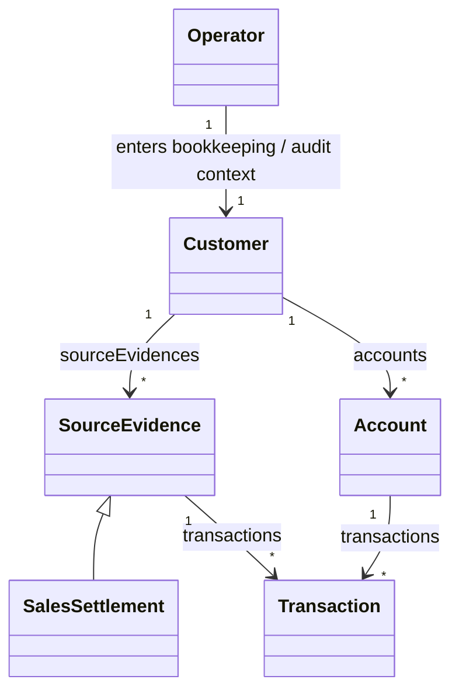

# Getting Started

This is the recommended Smart Domain learning path for new users.

The canonical case in this repository is now the `accounting` demo, adapted from
[`Re-engineering-Domain-Driven-Design/Accounting`](https://github.com/Re-engineering-Domain-Driven-Design/Accounting)
and extended with Smart Domain context switching.

Read it in this order:

1. download and import packages
2. draw the UML ownership and context boundaries
3. implement the model layer with association objects and context roles
4. implement persistence adapters
5. project the same model as a RESTful API

## 0. Download And Import Packages

Most users should start with the public entrypoints:

- `smart-domain-bom`
- `smart-domain-core`
- `smart-domain-mybatis-spring-boot-starter`
- `smart-domain-api-spring-boot-starter`

### Gradle

```gradle
dependencies {
    implementation platform("io.github.jayclock:smart-domain-bom:${smartDomainVersion}")
    implementation "io.github.jayclock:smart-domain-core"
    implementation "io.github.jayclock:smart-domain-mybatis-spring-boot-starter"
    implementation "io.github.jayclock:smart-domain-api-spring-boot-starter"
}
```

### Maven

```xml
<dependencyManagement>
  <dependencies>
    <dependency>
      <groupId>io.github.jayclock</groupId>
      <artifactId>smart-domain-bom</artifactId>
      <version>${smartDomainVersion}</version>
      <type>pom</type>
      <scope>import</scope>
    </dependency>
  </dependencies>
</dependencyManagement>

<dependencies>
  <dependency>
    <groupId>io.github.jayclock</groupId>
    <artifactId>smart-domain-core</artifactId>
  </dependency>
  <dependency>
    <groupId>io.github.jayclock</groupId>
    <artifactId>smart-domain-mybatis-spring-boot-starter</artifactId>
  </dependency>
  <dependency>
    <groupId>io.github.jayclock</groupId>
    <artifactId>smart-domain-api-spring-boot-starter</artifactId>
  </dependency>
</dependencies>
```

### What You Import In Code

At the model layer you will usually import:

```java
import io.github.jayclock.smartdomain.core.Entity;
import io.github.jayclock.smartdomain.core.HasMany;
import io.github.jayclock.smartdomain.core.Ref;
import io.github.jayclock.smartdomain.core.context.ContextRole;
import io.github.jayclock.smartdomain.core.context.ContextSwitcher;
```

At the persistence layer you will usually import:

```java
import io.github.jayclock.smartdomain.mybatis.AssociationMapping;
import io.github.jayclock.smartdomain.boot.EnableSmartDomainMybatis;
```

At the API layer you will usually import:

```java
import io.github.jayclock.smartdomain.api.hateoas.media.VendorMediaType;
```

## 1. Start From UML Ownership

The accounting demo starts from one root business context and four role switches.



What matters here is ownership and role boundary, not only cardinality:

- `Customer` owns `sourceEvidences`
- `Customer` owns `accounts`
- `Account` owns the reference-style `transactions` association
- `BookkeepingContext` switches `Operator -> Customer -> Bookkeeper`
- `AuditContext` switches `Operator -> Customer -> Auditor`
- `AccountContext` switches `Operator -> Account -> Accountant`
- `EvidenceReviewContext` switches `Operator -> SourceEvidence -> EvidenceReviewer`

Relevant files:

- `demo/src/main/java/reengineering/ddd/demo/accounting/model/Customer.java`
- `demo/src/main/java/reengineering/ddd/demo/accounting/model/Account.java`
- `demo/src/main/java/reengineering/ddd/demo/accounting/model/SourceEvidence.java`
- `demo/src/main/java/reengineering/ddd/demo/accounting/model/SalesSettlement.java`
- `demo/src/main/java/reengineering/ddd/demo/accounting/model/BookkeepingContext.java`
- `demo/src/main/java/reengineering/ddd/demo/accounting/model/AuditContext.java`

## 2. Turn UML Into The Model Layer

Each owned relationship becomes a first-class domain type instead of a raw `List`.

In the accounting demo:

- `Customer.sourceEvidences()` exposes `HasMany<String, SourceEvidence<?>>`
- `Customer.SourceEvidences` is the wide interface implemented by the persistence side
- `Customer.accounts()` exposes `HasMany<String, Account>`
- `Account.transactions()` exposes `HasMany<String, Transaction>`
- `Bookkeeper` and `Auditor` are customer-level context roles
- `Accountant` is an account-level context role
- `EvidenceReviewer` is a source-evidence-level context role

Read these files together:

- `demo/src/main/java/reengineering/ddd/demo/accounting/model/Customer.java`
- `demo/src/main/java/reengineering/ddd/demo/accounting/model/Account.java`
- `demo/src/main/java/reengineering/ddd/demo/accounting/model/Transaction.java`
- `demo/src/main/java/reengineering/ddd/demo/accounting/model/Bookkeeper.java`
- `demo/src/main/java/reengineering/ddd/demo/accounting/model/Auditor.java`
- `core/src/main/java/io/github/jayclock/smartdomain/core/context/ContextSwitcher.java`

The key rule is:

- entities own association fields
- entities expose narrow read APIs
- wide interfaces stay near the entity and define the persistence extension point
- role objects carry context-specific behavior instead of scattering permission checks into services

## 3. Implement Persistence Adapters

Once the model is stable, implement the wide interfaces in adapters.

### 3.1 Aggregated Lifecycle

The accounting demo keeps `SourceEvidence.transactions()` as an aggregated-style in-memory
association:

- `demo/src/main/java/reengineering/ddd/demo/accounting/memory/SourceEvidenceTransactions.java`
- `demo/src/main/java/reengineering/ddd/demo/accounting/memory/MemoryAssociation.java`

### 3.2 Reference Lifecycle

The same demo keeps `Account.transactions()` as a lazy MyBatis-style adapter:

- `demo/src/main/java/reengineering/ddd/demo/accounting/mybatis/AccountTransactions.java`
- `demo/src/main/java/reengineering/ddd/demo/accounting/mybatis/AccountingLedgerMapper.java`
- `demo/src/main/java/reengineering/ddd/demo/accounting/mybatis/config/AccountingDemoSmartDomainMybatisConfiguration.java`

Focus on the Smart Domain-specific pieces:

- `@AssociationMapping`
- `@EnableSmartDomainMybatis`
- `associationBasePackages`
- `leafEntityTypes`

## 4. Project The Model As A RESTful API

After the domain and persistence layers are aligned, expose the same model as HATEOAS-first
resources.

The accounting demo is the end-to-end reference:

- `demo/src/main/java/reengineering/ddd/demo/accounting/api/AccountingApi.java`
- `demo/src/main/java/reengineering/ddd/demo/accounting/api/AccountingRootModel.java`
- `demo/src/main/java/reengineering/ddd/demo/accounting/api/CustomerModel.java`
- `demo/src/main/java/reengineering/ddd/demo/accounting/api/AccountModel.java`
- `demo/src/main/java/reengineering/ddd/demo/accounting/api/SourceEvidenceModel.java`
- `demo/src/main/java/reengineering/ddd/demo/accounting/api/TransactionModel.java`
- `demo/src/main/java/reengineering/ddd/demo/accounting/api/AccountingMediaTypes.java`
- `demo/src/main/java/reengineering/ddd/demo/accounting/api/AccountingDemoApplication.java`

Read it in this sequence:

1. `AccountingApi`
2. `CustomerModel`
3. `AccountModel`
4. `SourceEvidenceModel`
5. `AccountingMediaTypes`
6. `AccountingDemoApplication`

## 5. How To Run The Accounting Case

Run the demo from the product root:

```bash
cd smart-domain
./gradlew :demo:bootRun
```

Then open the accounting endpoints:

- `GET /api/accounting`
- `GET /api/accounting/operators/{operatorId}`
- `GET /api/accounting/customers/{customerId}`
- `POST /api/accounting/customers/{customerId}/source-evidences/sales-settlements`
- `GET /api/accounting/customers/{customerId}/accounts/{accountId}`
- `GET /api/accounting/customers/{customerId}/source-evidences/{evidenceId}`
- `GET /api/accounting/agent-tree`

If you want a runnable AI-facing example that reads the JSON tree and constructs request payloads
from HAL-FORMS templates, run:

```bash
node demo/examples/accounting-agent-mvp.js
```

That script uses AI-provided `agent-plan` step arrays to show how an agent can execute multi-step
rel paths, emit a readable trace, and finish with a resource summary instead of hardcoded URLs.

## 6. Recommended Reading Order

If you want the shortest path from concept to running code, use this sequence:

1. `README.md`
2. `demo/README.md`
3. `demo/src/main/java/reengineering/ddd/demo/accounting/model/Customer.java`
4. `demo/src/main/java/reengineering/ddd/demo/accounting/model/Bookkeeper.java`
5. `demo/src/main/java/reengineering/ddd/demo/accounting/memory/InMemoryCustomers.java`
6. `demo/src/main/java/reengineering/ddd/demo/accounting/mybatis/AccountTransactions.java`
7. `demo/src/main/java/reengineering/ddd/demo/accounting/mybatis/config/AccountingDemoSmartDomainMybatisConfiguration.java`
8. `demo/src/main/java/reengineering/ddd/demo/accounting/api/AccountingApi.java`
9. `api-quick-start.md`
10. `samples/api-consumer/README.md`
