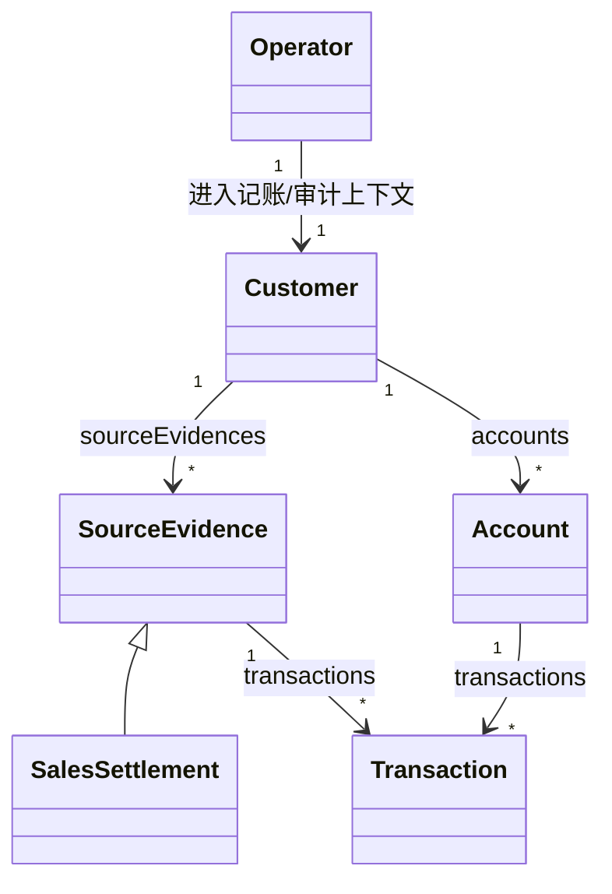
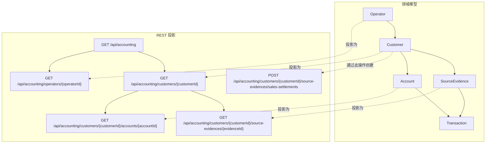

# 入门指南

[English](./getting-started.md) | 简体中文

这是新用户学习 Smart Domain 的推荐路径。仓库的标准案例是 `accounting` Demo，它来自公开的 [`Re-engineering-Domain-Driven-Design/Accounting`](https://github.com/Re-engineering-Domain-Driven-Design/Accounting)，并增加了 Smart Domain 上下文切换。

建议按以下顺序学习：

1. 阅读规范性[模式契约](./docs/pattern-contract.zh-CN.md)；
2. 下载并导入组件；
3. 画出根关联、UML 所有权、导航路径和上下文边界；
4. 使用关联对象和上下文角色实现模型层；
5. 实现持久化适配器；
6. 将同一个模型投影为 REST API。

整个流程采用 No-Service 架构，不要在 API 与连通领域模型之间增加应用 Service。

## 0. 下载并导入组件

大多数用户从以下公共入口开始：

- `smart-domain-bom`
- `smart-domain-core`
- `smart-domain-mybatis-spring-boot-starter`
- `smart-domain-api-spring-boot-starter`

### Gradle

```gradle
dependencies {
    implementation platform("io.github.jayclock:smart-domain-bom:${smartDomainVersion}")
    implementation "io.github.jayclock:smart-domain-core"
    implementation "io.github.jayclock:smart-domain-mybatis-spring-boot-starter"
    implementation "io.github.jayclock:smart-domain-api-spring-boot-starter"
}
```

### Maven

```xml
<dependencyManagement>
  <dependencies>
    <dependency>
      <groupId>io.github.jayclock</groupId>
      <artifactId>smart-domain-bom</artifactId>
      <version>${smartDomainVersion}</version>
      <type>pom</type>
      <scope>import</scope>
    </dependency>
  </dependencies>
</dependencyManagement>

<dependencies>
  <dependency>
    <groupId>io.github.jayclock</groupId>
    <artifactId>smart-domain-core</artifactId>
  </dependency>
  <dependency>
    <groupId>io.github.jayclock</groupId>
    <artifactId>smart-domain-mybatis-spring-boot-starter</artifactId>
  </dependency>
  <dependency>
    <groupId>io.github.jayclock</groupId>
    <artifactId>smart-domain-api-spring-boot-starter</artifactId>
  </dependency>
</dependencies>
```

### 代码中的常用导入

模型层通常导入：

```java
import io.github.jayclock.smartdomain.core.Entity;
import io.github.jayclock.smartdomain.core.HasMany;
import io.github.jayclock.smartdomain.core.Ref;
import io.github.jayclock.smartdomain.core.context.ContextRole;
import io.github.jayclock.smartdomain.core.context.ContextSwitcher;
```

持久化层通常导入：

```java
import io.github.jayclock.smartdomain.mybatis.AssociationMapping;
import io.github.jayclock.smartdomain.boot.EnableSmartDomainMybatis;
```

API 层通常导入：

```java
import io.github.jayclock.smartdomain.api.hateoas.media.VendorMediaType;
```

## 1. 从根关联和 UML 所有权开始

在设计数据表或资源之前，先找出调用方进入模型的根关联。会计 Demo 的根契约是 `Customers` 和 `Operators`。HTTP 资源通过根找到实体，再直接调用实体或上下文角色：

```text
AccountingApi -> Customers -> Customer/Bookkeeper -> 关联适配器
```

该调用路径中没有应用 Service 或仓储编排层。

会计 Demo 包含一个根业务上下文和四种角色切换：



所有权和上下文边界是重点：

- `Customer` 拥有 `sourceEvidences`；
- `Customer` 拥有 `accounts`；
- `Account` 拥有引用生命周期的 `transactions`；
- `BookkeepingContext`：`Operator -> Customer -> Bookkeeper`；
- `AuditContext`：`Operator -> Customer -> Auditor`；
- `AccountContext`：`Operator -> Account -> Accountant`；
- `EvidenceReviewContext`：`Operator -> SourceEvidence -> EvidenceReviewer`。

相关文件：

- `demo/src/main/java/reengineering/ddd/demo/accounting/model/Customer.java`
- `demo/src/main/java/reengineering/ddd/demo/accounting/model/Account.java`
- `demo/src/main/java/reengineering/ddd/demo/accounting/model/SourceEvidence.java`
- `demo/src/main/java/reengineering/ddd/demo/accounting/model/SalesSettlement.java`
- `demo/src/main/java/reengineering/ddd/demo/accounting/model/BookkeepingContext.java`
- `demo/src/main/java/reengineering/ddd/demo/accounting/model/AuditContext.java`

## 2. 将 UML 转换为模型层

每个被拥有的关系都应成为一等领域类型，而不是原始 `List`。

会计 Demo 中：

- `Customer.sourceEvidences()` 暴露 `HasMany<String, SourceEvidence<?>>`；
- `Customer.SourceEvidences` 是由持久化侧实现的宽接口；
- `Customer.accounts()` 暴露 `HasMany<String, Account>`；
- `Account.transactions()` 暴露 `HasMany<String, Transaction>`；
- `Bookkeeper` 和 `Auditor` 是客户级上下文角色；
- `Accountant` 是账户级上下文角色；
- `EvidenceReviewer` 是原始凭证级上下文角色。

需要遵守的规则：

- 实体拥有关联字段；
- 实体对外暴露窄读取 API；
- 宽接口靠近实体定义，并作为持久化扩展点；
- 实体方法负责跨自身多个关联的业务行为；
- 角色对象负责上下文行为，而不是在 Service 中散布权限判断；
- 调用方通过根关联进入，而不是通过 Service 层进入。

建议一起阅读：

- `demo/src/main/java/reengineering/ddd/demo/accounting/model/Customer.java`
- `demo/src/main/java/reengineering/ddd/demo/accounting/model/Account.java`
- `demo/src/main/java/reengineering/ddd/demo/accounting/model/Transaction.java`
- `demo/src/main/java/reengineering/ddd/demo/accounting/model/Bookkeeper.java`
- `demo/src/main/java/reengineering/ddd/demo/accounting/model/Auditor.java`
- `core/src/main/java/io/github/jayclock/smartdomain/core/context/ContextSwitcher.java`

## 3. 实现持久化适配器

模型稳定后，由适配器实现领域拥有的宽接口。

### 3.1 聚合生命周期

`SourceEvidence.transactions()` 使用随拥有者一起物化的内存关联：

- `demo/src/main/java/reengineering/ddd/demo/accounting/memory/SourceEvidenceTransactions.java`
- `demo/src/main/java/reengineering/ddd/demo/accounting/memory/MemoryAssociation.java`

### 3.2 引用生命周期

`Account.transactions()` 使用 MyBatis 风格的延迟关联适配器：

- `demo/src/main/java/reengineering/ddd/demo/accounting/mybatis/AccountTransactions.java`
- `demo/src/main/java/reengineering/ddd/demo/accounting/mybatis/AccountingLedgerMapper.java`
- `demo/src/main/java/reengineering/ddd/demo/accounting/mybatis/config/AccountingDemoSmartDomainMybatisConfiguration.java`

Smart Domain 特有配置包括：

- `@AssociationMapping`
- `@EnableSmartDomainMybatis`
- `associationBasePackages`
- `leafEntityTypes`

适配器只负责加载、保存和映射，不负责业务规则。

## 4. 将模型投影为 REST API

领域和持久化层对齐后，再把同一个模型暴露为 HATEOAS 资源。

完整示例文件：

- `demo/src/main/java/reengineering/ddd/demo/accounting/api/AccountingApi.java`
- `demo/src/main/java/reengineering/ddd/demo/accounting/api/AccountingRootModel.java`
- `demo/src/main/java/reengineering/ddd/demo/accounting/api/CustomerModel.java`
- `demo/src/main/java/reengineering/ddd/demo/accounting/api/AccountModel.java`
- `demo/src/main/java/reengineering/ddd/demo/accounting/api/SourceEvidenceModel.java`
- `demo/src/main/java/reengineering/ddd/demo/accounting/api/TransactionModel.java`
- `demo/src/main/java/reengineering/ddd/demo/accounting/api/AccountingMediaTypes.java`
- `demo/src/main/java/reengineering/ddd/demo/accounting/api/AccountingDemoApplication.java`

建议按以下顺序阅读：

1. `AccountingApi`
2. `CustomerModel`
3. `AccountModel`
4. `SourceEvidenceModel`
5. `AccountingMediaTypes`
6. `AccountingDemoApplication`

API 是领域对象图的投影：



图中实体、上下文角色、关联和生命周期应被看作一个连通设计，而不是互不相关的层。

## 5. 运行会计案例

```bash
cd smart-domain
./gradlew :demo:bootRun
```

可访问：

- `GET /api/accounting`
- `GET /api/accounting/operators/{operatorId}`
- `GET /api/accounting/customers/{customerId}`
- `POST /api/accounting/customers/{customerId}/source-evidences/sales-settlements`
- `GET /api/accounting/customers/{customerId}/accounts/{accountId}`
- `GET /api/accounting/customers/{customerId}/source-evidences/{evidenceId}`

## 6. 最短阅读路径

1. `docs/pattern-contract.zh-CN.md`
2. `README.zh-CN.md`
3. `demo/README.zh-CN.md`
4. `docs/association-recipes.zh-CN.md`
5. `demo/src/main/java/reengineering/ddd/demo/accounting/model/Customer.java`
6. `demo/src/main/java/reengineering/ddd/demo/accounting/model/Bookkeeper.java`
7. `demo/src/main/java/reengineering/ddd/demo/accounting/memory/InMemoryCustomers.java`
8. `demo/src/main/java/reengineering/ddd/demo/accounting/mybatis/AccountTransactions.java`
9. `demo/src/main/java/reengineering/ddd/demo/accounting/mybatis/config/AccountingDemoSmartDomainMybatisConfiguration.java`
10. `demo/src/main/java/reengineering/ddd/demo/accounting/api/AccountingApi.java`
11. `docs/anti-patterns.zh-CN.md`
12. `api-quick-start.zh-CN.md`
13. `samples/api-consumer/README.zh-CN.md`
